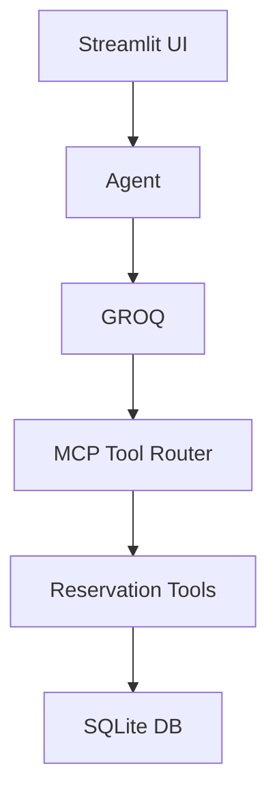
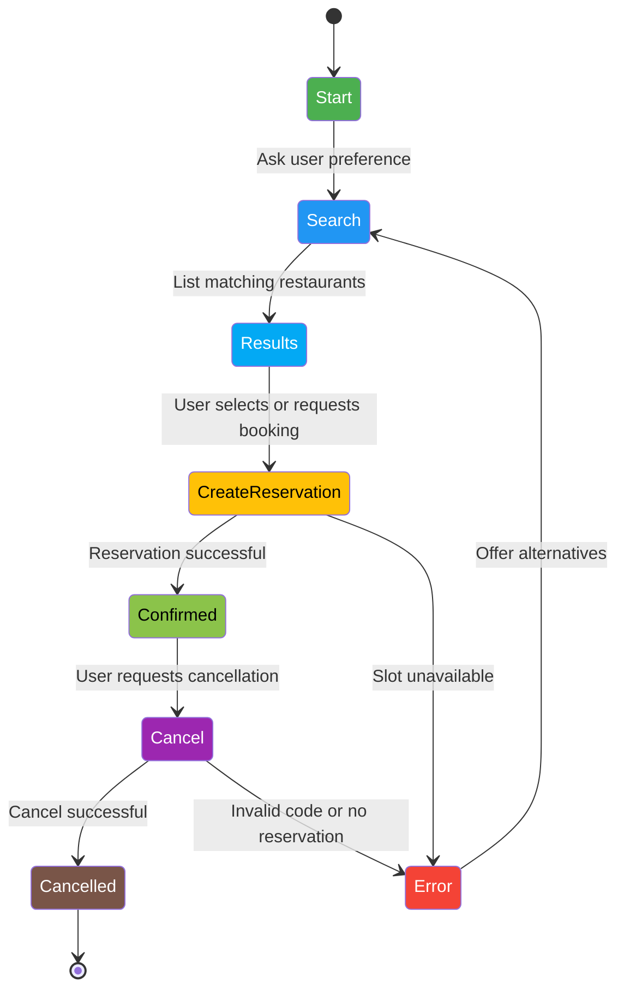

# 🧀 GoodFoods AI Reservation System

AI-powered conversational restaurant reservation system using Llama-3.3-8B, Streamlit, SQLite, and MCP-style agentic tool calling architecture.

[]([http://localhost:8501](https://jagadeeshwar45-restaurant-reservation-s-appstreamlit-app-0ppi1h.streamlit.app/)/)

## Documentation

[🔗 Use Case Document](https://docs.google.com/document/d/1Jhk1tLEtI55gZOy5Y9PQDEDuzmqGPeUv3ys4IHLubz8/edit?usp=sharing)

## 🚀 Project Overview

GoodFoods Reservation System optimizes reservation flow across multiple restaurant locations—improving customer experience, maximizing seating efficiency, and boosting profitability through intelligent automation.

## ✨ Key Capabilities

- 🤖 **LLM-powered** natural language reservation booking
- 🔍 Smart restaurant search & recommendation engine
- 📅 Real-time booking management & availability conflict detection
- ❌ Cancel reservations using Restaurant ID
- 🧠 Tool-calling based decision architecture (no manual rules)
- 🖥 Streamlit frontend for live interaction & admin dashboard

## 🏗 Architecture



### Key Features

- ✔ Intent is identified by the LLM itself, not manual string matching
- ✔ Scalable and expandable tool-calling infrastructure

## 🧠 Prompt Engineering Approach

### 🟢 System Prompt Strategy

- Force the model to operate as a tool-calling agent
- Require ONLY structured JSON output
- Dynamically inject available tools into the prompt context

### 🛠 Prompt Format

```json
SYSTEM:
You are the GoodFoods AI Reservation Agent.
Use MCP-style tool invocation:
{
  "intent": "<tool_name>",
  "params": { ... }
}
Never include text outside JSON.
```

### 🧪 Few-Shot Example

```json
{"intent":"search_restaurants","params":{"cuisine":"Italian","seats":6}}
```

### 💡 Recommendation Logic

**Ranking Priority:**
1. Restaurant match
2. Cuisine match
3. Minimum seat capacity
4. Restaurant features (outdoor, rooftop, parking, live music)
5. Closest capacity fit

**Fallback:**
> "No Italian restaurant for 6 people — would you like GoodFoods Rivera (Mexican) instead?"

## 🔧 Setup Instructions

### 📦 Requirements

| Tool | Version |
|------|---------|
| Python | 3.10+ |
| llama-cpp-python | latest |
| Streamlit | latest |
| SQLite | included |
| GROQ | API |

### 📁 Installation

```bash
git clone https://github.com/Jagadeeshwar45/Restaurant-Reservation-System.git
cd Restaurant-Reservation-System
pip install -r requirements.txt
```


### ⚙ Environment Variables

## 🔑 Groq API Setup

Create `.env` file:
```env
GROQ_API_KEY=your_groq_key
```

### ▶ Run Project

```bash
streamlit run app/streamlit_app.py
```

## 💬 Example User Conversations

### Booking
**User:**  
Book a table for 6 tomorrow at 8pm in an Italian restaurant

**Assistant:**  
🎉 Reservation Confirmed!  
**Restaurant:** GoodFoods Peters (Italian)  
**Address:** PSC 0195, Box 6144, APO AA 50711  
**Date:** Thursday, 27 February 2025 at 08:00 PM  
**Party Size:** 6

### Finding Recommendations
**User:**  
Suggest a restaurant for 4 with outdoor seating

### Cancel Reservation
**User:**  
Cancel reservation at restaurant code 52

## ♟ State Transition Diagram



## 💼 Business Strategy Summary

### 📍 Key Opportunities

| Business Need | Solution |
|--------------|----------|
| Manual booking workload | Automated conversational agent |
| Lost seating efficiency | AI-based seat allocation |
| Revenue leakage | Upsell dish/event recommendations |
| Lack of visibility | Real-time reservation tracking |

### 📈 Success Metrics

| KPI | Target |
|-----|--------|
| Table occupancy | +18–25% |
| Call center load | –40% |
| Cancellation salvage | +10–12% |
| Annual revenue increase | +12–15% |

### 💰 ROI Expectation

The system pays for itself within 6–9 months through:
- Labor savings
- Optimized seating utilization
- Upsell conversions

## 🔜 Future Enhancements

- Loyalty & rewards integration
- Automated wait-list management
- Group & corporate bookings
- Digital payments & deposit workflow
- Multi-brand SaaS deployment

## 📂 Folder Structure

```
app/
 ├── agent.py
 ├── tools.py
 ├── prompts.py
 ├── reservations.py
 ├── db.py
 ├── llm_clients.py
 └── streamlit_app.py
data/
 ├── restaurants.json
 └── reservations.db
